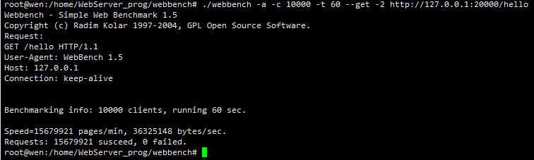
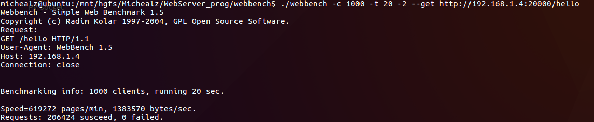
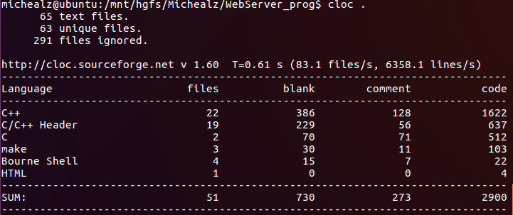

HttpServer
==========
A webserver developed using modern c++

# Introduction
该项目参考muduo实现了一个多线程静态的web服务器。HttpServer使用c++11实现，支持head、post和get请求，使用 
epoll ET边沿触发提高实时性。HttpServer支持短连接、长连接，和采用timerfd实现的应用层心跳。

# Environment
Ubuntu 16.04, i5-8G 
gcc-5.4, g++-5.4

# Usage
* 编译 
    make -j4 
    cd webbench && make
* 运行 
    ./run.sh 
    ./webbench.sh
    
# Architecture
该项目采用reactor+NIO+thread pool+epoll ET的模型设计而成。 

# Performance Test
使用webbench，测试non-keepalive和keepalive Http连接下的表现。 
* 10k 长连接测试

* 1k 短链接测试

# Others
* 代码统计 

* 内存泄露检测 
使用valgrid中memcheck工具，检测HttpServer内存泄露情况。 
检测方法: ./memcheck.sh 

* 监控 
使用top命令和/proc/${PID}/中内省，检测HttpServer运行时CPU利用率，内存以及文件描述符使用情况。 
使用方法: ./monitor.sh 
